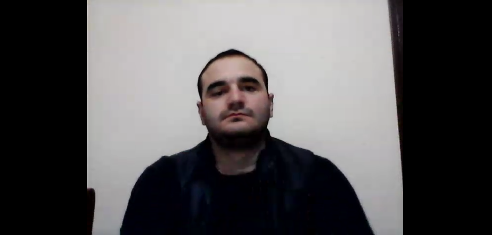
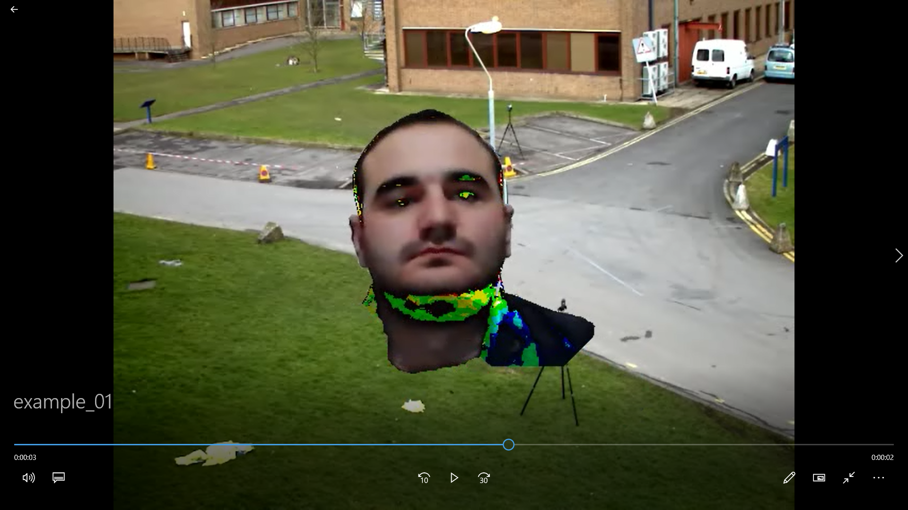

# A small video background editor that allows to substitute background of one video to another

The program allows to specify video files (local paths to the data) through the config.INI configuration file.

Please notice that the videos should have non-moving backgrounds, meaning that the camera used to shoot the videos is fixed on the wall or somewhere else.

The program consists of the following steps:

    1. Background extraction.
    2. Foreground (moving object) extraction and change of background.

## 1. Background subtraction from video

We can assume most of the time, every pixel sees the same piece of the background because the camera is not moving. Occasionally, moving object comes in the front and obscure the background. For a video sequence, we can randomly sample a few frames (say 25 frames) per second. So, for every pixel, we now have 25 values of the background. As long as a pixel is not covered by a moving object more than 50% of the time, the median of the pixel over these frames will give a good estimate of the background at that pixel.

Another way to do it, is ***Mixture of Gaussians(MOG or new MOG2)***. It is a Gaussian Mixture-based Background/Foreground Segmentation Algorithm, based on two papers by Z.Zivkovic, "Improved adaptive Gausian mixture model for background subtraction" in 2004 and "Efficient Adaptive Density Estimation per Image Pixel for the Task of Background Subtraction" in 2006. One important feature of MOG2 algorithm is that it selects the appropriate number of gaussian distribution for each pixel (for example in MOG, we took a K gaussian distributions throughout the algorithm). It provides better adaptibility to varying scenes due illumination changes etc.

## 2. Foreground extraction and change of background.

We can use ***GrabCut*** algorithm to extract foreground and take linear combination between new background and foreground.

Now a little more details about GrabCut. 

GrabCut algorithm was designed by Carsten Rother, Vladimir Kolmogorov & Andrew Blake from Microsoft Research Cambridge, UK. in their paper, "GrabCut: interactive foreground extraction using iterated graph cuts" . An algorithm was needed for foreground extraction with minimal user interaction, and the result was GrabCut. Initially user draws a rectangle (RoI) around the foreground region (foreground region should be completely inside the rectangle). Then algorithm segments it iteratively to get the best result. Done. But in some cases, the segmentation won't be fine, like, it may have marked some foreground region as background and vice versa. 

Before                     |  After
:-------------------------:|:-------------------------:
   |  

